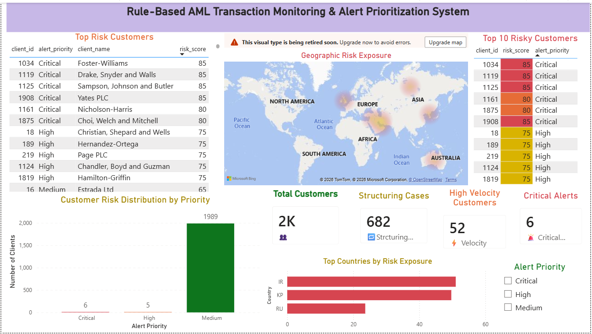

# AML Transaction Monitoring & Alert Prioritization System

##  Project Overview
This project simulates a **rule-based Anti-Money Laundering (AML) transaction monitoring system** using Excel, SQL and Power BI. It focuses on detecting suspicious transaction patterns and prioritizing alerts based on customer risk profiles.

The system integrates:
- Transaction data
- Customer KYC data
- Risk-based scoring
- Rule-based detection

---

##  Dashboard Preview



---

##  Objectives
- Detect suspicious transaction patterns (structuring, high velocity)
- Identify high-risk customers based on KYC attributes
- Build a risk scoring model for alert prioritization
- Visualize insights using Power BI dashboard

---

##  AML Rules Implemented

### 1. High-Risk Customer Activity
Customers classified using:
- PEP flag
- FATF high-risk country exposure
- Sector risk

---

### 2. Structuring Detection (Smurfing)
- Transactions between €9,000–€10,000  
- Flag if repeated ≥ 5 times  

---

### 3. High Velocity Transactions
- High transaction frequency within short periods  
- Proxy used: high frequency flag  

---

### 4. Risk Scoring Model

| Rule | Points |
|------|--------|
| High transaction amount | 20 |
| High frequency | 20 |
| FATF country exposure | 25 |
| Structuring behavior | 20 |
| PEP flag | 15 |

---

### 5. Alert Prioritization

| Score | Priority |
|------|----------|
| ≥ 80 | 🔴 Critical |
| 70–79 | 🟠 High |
| < 70 | 🟢 Medium |

---

##  Data Sources

- Simulated AML Transaction Dataset (SAML-D)
- Synthetic KYC Dataset

---

##  Power BI Dashboard Features

- KPI Cards (Total Clients, Critical Alerts, Structuring Alerts, Velocity Alerts)
- Top Risk Customers Table
- Top 10 High-Risk Customers
- Risk Distribution Chart
- Geographic Risk Map (Country-level exposure)
- Country Risk Analysis
- Interactive Slicer (Alert Priority)

---

##  Project Structure

```

 data/
      transactions_sample.csv       
      accounts_customers.csv       
      clients.csv                   

 sql/
      aml_queries.sql              

 dashboard/
      (PBIX file via Google Drive) 


 images/
      dashboard_overview.png                

 README.md                        


```


---

##  Files (Large Files via Google Drive)

-  Full Transaction Dataset:  
 [Download Transactions Dataset](https://drive.google.com/file/d/1FNQ1NlKW73B_JLmpBUo44KMx0V17yl8V/view?usp=drive_link)

-  Power BI Dashboard (.pbix):  
   [Download PBIX File](https://drive.google.com/file/d/1wVJ-at838TAN0Q8m7FNJ3Oq5aipRBiTd/view?usp=drive_link)

---

##  Tools Used

- SQL Server → Data processing & rule engine  
- Power BI → Visualization & dashboard  
- Excel → Data preparation & prototyping  

---

##  Key Insights

- High-risk customers exhibit significantly higher transaction volumes  
- Structuring patterns detected across multiple accounts  
- High velocity behavior indicates potential layering activity  
- Risk is concentrated in specific geographic regions  
- Combining behavioral and KYC risk improves alert prioritization  

---

##  Key Learnings

- Built an end-to-end AML monitoring workflow  
- Applied rule-based detection aligned with industry practices  
- Designed explainable risk scoring model  
- Developed interactive dashboard for decision-making  

---

##  Future Improvements

- Real-time transaction monitoring  
- Machine learning anomaly detection  
- Network analysis (account relationships)  
- Integration with sanctions screening systems  

---

##  Author

Avinash Abk

